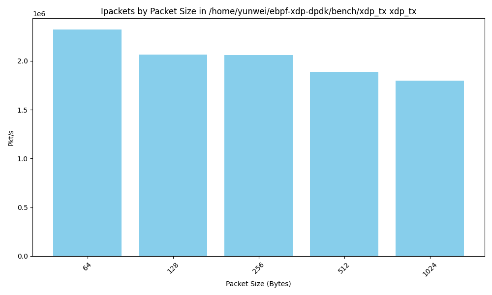
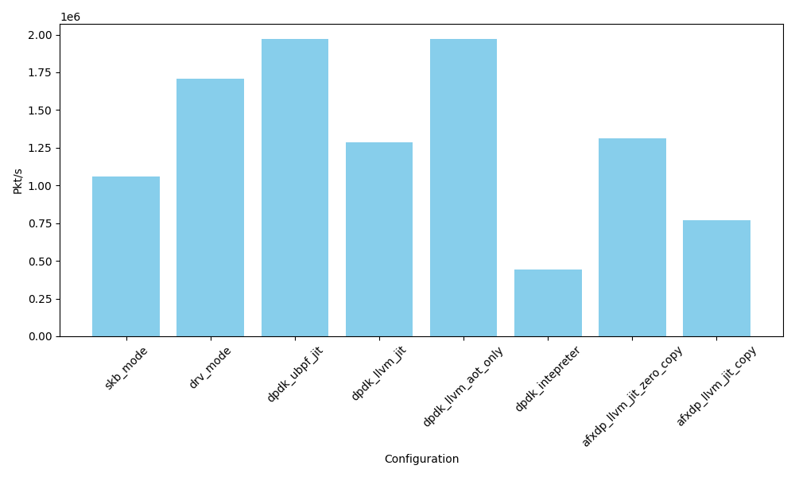
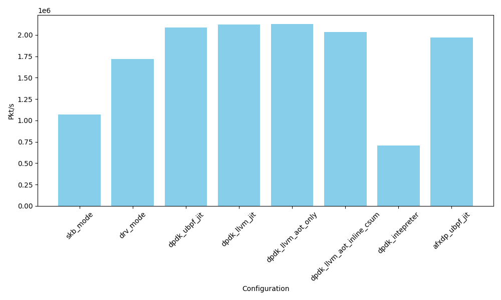
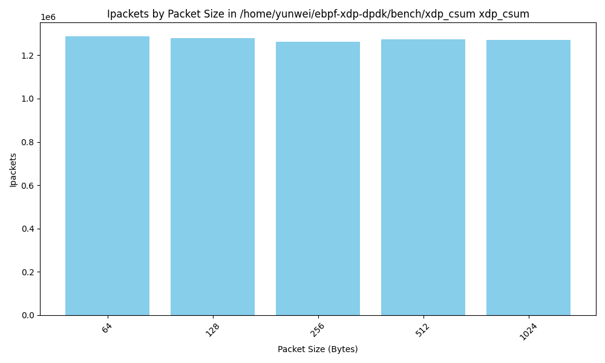
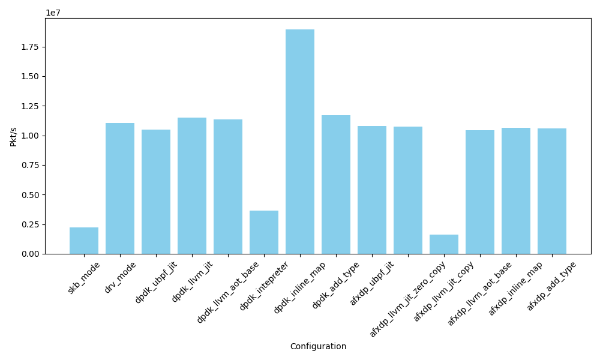
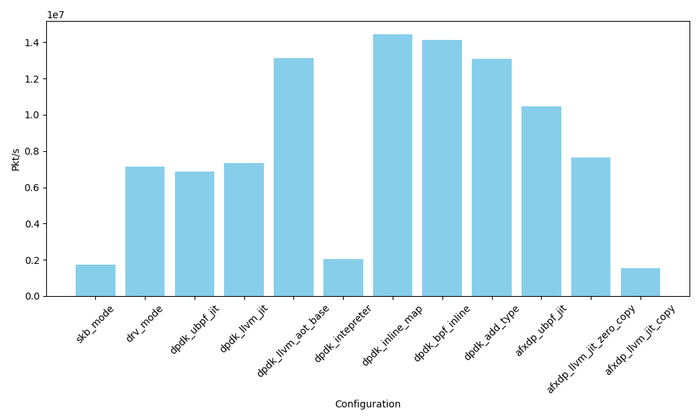
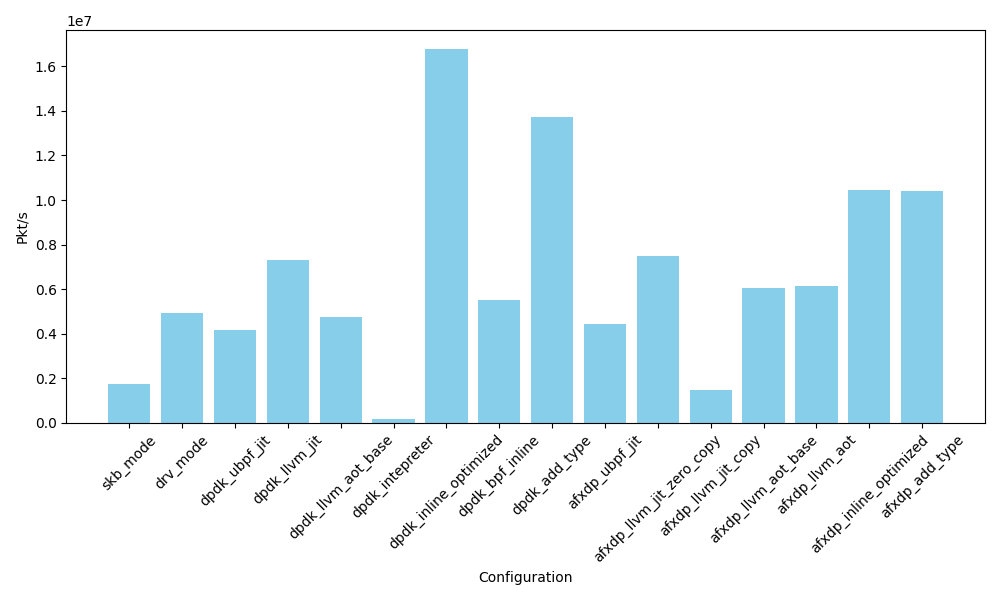
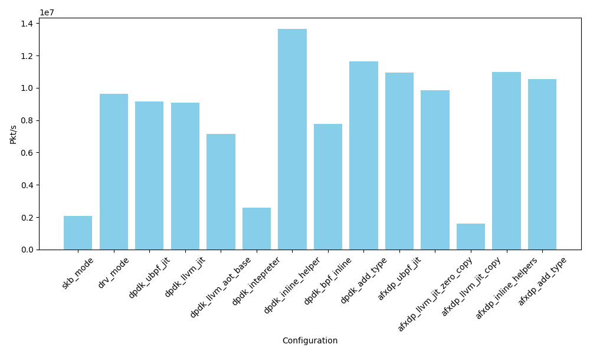

# test framework and results

- [test framework and results](#test-framework-and-results)
 	- [test setup](#test-setup)
 	- [Test configurations](#test-configurations)
  		- [DPDK](#dpdk)
  		- [af\_xdp](#af_xdp)
  		- [LLVM JIT](#llvm-jit)
  		- [ubpf JIT](#ubpf-jit)
  		- [LLVM AOT](#llvm-aot)
 	- [Case: xdp\_tx](#case-xdp_tx)
  		- [For different configurations](#for-different-configurations)
  		- [For different size](#for-different-size)
 	- [different latency](#different-latency)
 	- [Case: xdp\_map\_access](#case-xdp_map_access)
  		- [Take aways](#take-aways)
 	- [Case: xdp\_csum](#case-xdp_csum)
  		- [Take aways](#take-aways-1)
 	- [Case: xdp\_hash\_sum](#case-xdp_hash_sum)
  		- [Take aways](#take-aways-2)
 	- [Case: xdping](#case-xdping)
 	- [Case: xdp\_map](#case-xdp_map)
 	- [Case: xdp\_firewall](#case-xdp_firewall)
 	- [Case: xdp\_adjust\_tail](#case-xdp_adjust_tail)
 	- [Case: xdp\_lb](#case-xdp_lb)
 	- [xdp-observer](#xdp-observer)
 	- [xdp-tcpclassify](#xdp-tcpclassify)
 	- [commands to run the test](#commands-to-run-the-test)

## test setup

We have machine octopus1 and octopus3

```txt
+--------+       +--------+
|octopus1|------>|octopus3|
| Pktgen |<------|   NFs  |
+--------+       +--------+
```

- The traffic is generated by `pktgen` on octopus1 and received by NFs on octopus3. The NFs are running on octopus3, forwards the packets back to octopus1. The traffic generator and measurement tools are `Pktgen-dpdk`.
- The reuslts are measured by the received packets on octopus1. The results are averaged over `60` seconds.
- The controler script is also running on octopus2, use ssh to control the pktgen and get the data from octopus1.
- 100G NICs are used for the test.

octopus1:

```
Intel(R) Xeon(R) Gold 5318N CPU @ 2.10GHz
Core Count: 24
Core Enabled: 24
Thread Count: 48
Caches (sum of all):      
  L1d:                    1.1 MiB (24 instances)
  L1i:                    768 KiB (24 instances)
  L2:                     30 MiB (24 instances)
  L3:                     36 MiB (1 instance)
NUMA:                     
  NUMA node(s):           1
  NUMA node0 CPU(s):      0-47
$ uname -a
Linux octopus1 6.3.4-060304-generic #202305241735 SMP PREEMPT_DYNAMIC Wed May 24 17:46:36 UTC 2023 x86_64 x86_64 x86_64 GNU/Linux
$ lspci -nn | grep -i 'mellanox'
18:00.0 Ethernet controller [0200]: Mellanox Technologies MT2892 Family [ConnectX-6 Dx] [15b3:101d]
18:00.1 Ethernet controller [0200]: Mellanox Technologies MT2892 Family [ConnectX-6 Dx] [15b3:101d]
```

octopus3(DUT):

```
Version: Intel(R) Xeon(R) Gold 5318N CPU @ 2.10GHz
$ uname -a
Linux octopus3 6.7.10-zabbly+ #ubuntu22.04 SMP PREEMPT_DYNAMIC Wed Mar 20 00:36:40 UTC 2024 x86_64 x86_64 x86_64 GNU/Linux
$ lspci -nn | grep -i 'mellanox'
18:00.0 Ethernet controller [0200]: Mellanox Technologies MT2892 Family [ConnectX-6 Dx] [15b3:101d]
18:00.1 Ethernet controller [0200]: Mellanox Technologies MT2892 Family [ConnectX-6 Dx] [15b3:101d]
```

## Test configurations

By default, all userspace eBPF runtime or applications are compiled with `-O3` optimization level, and `LTO` is enabled. We found that ubpf may be error-prone when compiled with `LTO` enabled, so some of the data points may be missing.

For the kernel eBPF, it's tested on `Linux octopus3 6.7.10-zabbly+ #ubuntu22.04 SMP PREEMPT_DYNAMIC x86_64 GNU/Linux`.

### DPDK

The dpdk application is tested with command:

```console
$ sudo -E LD_LIBRARY_PATH=/home/yunwei/ebpf-xdp-dpdk/external/dpdk/install-dir/lib/x86_64-linux-gnu/:/usr/lib64/:/home/yunwei/ebpf-xdp-dpdk/build-bpftime/bpftime/libbpf/:/home/yunwei/ebpf-xdp-dpdk/afxdp/lib/xdp-tools/lib/libxdp/:/home/yunwei/ebpf-xdp-dpdk/build-bpftime-llvm/bpftime/libbpf /home/yunwei/ebpf-xdp-dpdk/dpdk/dpdk_llvm -l 1  --socket-mem=512 -a 0000:18:00.1 -- -p 0x1

load eBPF program xdp_pass
set entry program xdp_pass
init eBPF runtime success
EAL: Detected CPU lcores: 48
EAL: Detected NUMA nodes: 1
EAL: Detected static linkage of DPDK
EAL: Multi-process socket /var/run/dpdk/rte/mp_socket
EAL: Selected IOVA mode 'PA'
```

It's using a single core and single port, with 512MB memory. The application is modified from the `l2fwd` example in the dpdk.

### af_xdp

The af_xdp example is tested with

```sh
cd afxdp/l2fwd
sudo ./xdpsock_llvm --l2fwd -i enp24s0f1np1
```

The kernel eBPF part is:

```c

struct {
 __uint(type, BPF_MAP_TYPE_XSKMAP);
 __uint(max_entries, MAX_SOCKS);
 __uint(key_size, sizeof(int));
 __uint(value_size, sizeof(int));
} xsks_map SEC(".maps");

int num_socks = 0;
static unsigned int rr;

SEC("xdp_sock") int xdp_sock_prog(struct xdp_md *ctx)
{
 rr = (rr + 1) & (num_socks - 1);
 return bpf_redirect_map(&xsks_map, rr, XDP_DROP);
}
```

The default configuration is:

```txt
  Options:
  -q, --queue=n Use queue n (default 0)
  -f, --frame-size=n   Set the frame size (must be a power of two in aligned mode, default is 4096).
  -b, --batch-size=n    Batch size for sending or receiving
                        packets. Default: 64
  -W, --policy=POLICY  Schedule policy. Default: SCHED_OTHER
  -U, --schpri=n       Schedule priority. Default: 0
  -B, --busy-poll      Busy poll.
```

busy-wake-up(Which is our previous default) `SO_PREFER_BUSY_POLL true, XDP_USE_NEED_WAKEUP true`

It will run on single core, the kernel will default using zero copy mode and xdp-native mode.

enable different config of AF_XDP(Using simple XDP_TX):

- busy-not-wake-up: `SO_PREFER_BUSY_POLL true, XDP_USE_NEED_WAKEUP false`: 9,870,746
- busy-wake-up(Which is our previous default): `SO_PREFER_BUSY_POLL true, XDP_USE_NEED_WAKEUP true`: 9,598,103
- sys-poll-not-wake-up: `use syscall for polling, XDP_USE_NEED_WAKEUP false`: 7,973,450


### LLVM JIT

The baseline configuration for LLVM based JIT.

- Generated LLVM IR from eBPF bytecode. We don't add type information to the IR at this level, so some constraints amybe missing, such as the type of the function, loop bounds, pointer layout, etc.
- Optimized with `-O3` level in the JIT compiled.
- load with the same linker as the AOT runtime.

See <https://github.com/eunomia-bpf/bpftime/tree/master/vm/llvm-jit>

### ubpf JIT

The baseline configuration for ubpf JIT.

This is a port of ubpf JIT in bpftime.

- Generated Native insts from eBPF bytecode.
- No additional optimization is applied.
- The compile process is faster.

See <https://github.com/eunomia-bpf/bpftime/tree/master/vm/simple-jit>

### LLVM AOT

bpftime AOT engine has split the JIT into two steps:

1. Compile a eBPF bytecode into LLVM IR, and then compile the LLVM IR into native code. You can export the native code as a ELF object file(`.o`).
2. Load the ELF object file into the runtime, lin it wth helpers and maps, check the stack layout, and then execute it.

It can help us explore better optimization approaches, since the load Native ELF doen't need to be compiled from the eBPF bytecode directly(Actually you can even do it with rust). We can have approaches like:

- C -> eBPF bytecode -> LLVM IR -> LLVM IR with type information -> Native code(SIMD) ELF -> Load with AOT runtime
  
Or

- C -> eBPF bytecode -> verified -> C with some changes for relocation on AST level -> clang -> Native code ELF(SIMD) -> Load with AOT runtime.
  - This is like the eBPF for windows(They have a bpf2c tool)
  - After verfying the LLVM IR code, we transform and relocated the original eBPF C code, and directly compile it with clang. (So we need the eBPF source C code)

The linker(Which help load AOT programs into the runtime) checks:

- The type of the functions and helpers are correct.
- The stack and maps layout are correct.
- All necessary helpers are available in the runtime.

A typical workflow for the AOT process would be:

- The eBPF application create all maps, eBPF prorgams and define which helper set to use. This information is stored in shared memory.
- The relocation of map id or BTF will be performed by the eBPF application with the help of the runtime.
- The verifier checks the eBPF programs, maps, and helpers.
- The AOT compiler `#1` compiles the verified eBPF programs to LLVM IR and Native code, or `#2` based on the type information from the source code, we do some additional process in AST level from the source code with our tools, and compile them to LLVM IR and Native code.
- The AOTed object file is loaded by the runtime with the build-in linker, and can be executed by the runtime as other eBPF programs.

The AOT process will do:

- Compile with `-O3 -fno-stack-protector` and make sure the stack layout is correct.
- Replace the entrance of the eBPF program with function name `bpf_main`.
- All the helpers are replace with corresponding type info and name like `_bpf_helper_ext_0028`

There are three possible optimizaions in AOT:

- Add Type information and allow the LLVM to do better optimization.
  - Observe: The eBPF bytecode is typeless, so if we JIT from the bytecode only, the LLVM will not be able to do some optimization, such as inlining, loop unrolling, SIMD, etc. With the type information, the LLVM can do better optimization.
  - Approach: Add type information to the LLVM IR or from the source code.
- inline helpers.
  - Observe: Some helpers, such as copy data, strcmp, calc csum, generated random value, are very simple and Don't interact with other maps. They exist because the limitation of verifier. Inline them will avoid the cost of helper function call and enabled better optimizaion from LLVM.
  - Approach: Prepare a helper implementations in C or LLVM IR, which can be compile and linked with the AOT eBPF res.
  - We could also use better and specific implementation for the helpers.
- inline maps.
  - Observe: some maps are for configurations only, once they are loaded, they will not be read by userspace programs. They are also not shared between different eBPF programs. For example, the `target_pid` filtter in the tracing programs, or some config maps in network programs. Inline them will avoid the cost of map lookup and enabled better optimizaion from LLVM, since the eBPF inst will need helpers or something like `__lddw_helper_map_by_fd` to access them.
  - Approach: inline the maps as global variables in the native code, so that it can be process by the AOT linker. The linker will allocate this `global variables` as the real global variables in the runtime instead of maps, and replace the map access with the address of the global variable directly.

For network packet process, we can also batch the packets, like:

```c
inline int xdp_pass(struct xdp_md *ctx)
{
 void *data_end = (void *)(long)ctx->data_end;
 void *data = (void *)(long)ctx->data;
 struct ethhdr *eth = data;
 int rc;
 u64 nh_off;
 long dummy_value = 1;

 nh_off = sizeof(*eth);
 if (data + nh_off > data_end)
  return rc;

 swap_src_dst_mac(data);

 return XDP_TX;
}

int batch_xdp_pass(struct xdp_md *ctx_array[]) {
 for (int i = 0; i < SIZE; i++) {
  xdp_pass(ctx_array[i]);
 }
 return XDP_TX;
}
```

But in this way, SIMD may not work well, since the mutiple packet buffer is not linear in memory. SIMD may work for batching process like:

```c
// Example packet data (simplified)
uint8_t packets[][20] = {
    {0x45, 0x00, 0x00, 0x73, 0x00, 0x00, 0x40, 0x00, 0x40, 0x11},
    {0x45, 0x00, 0x00, 0x54, 0x00, 0x00, 0x40, 0x00, 0x40, 0x01},
    {0x00, 0x45, 0x00, 0x00, 0x73, 0x00, 0x00, 0x40, 0x00, 0x40},
    // Add more packets for testing
};
```

In DPDK or AF_XDP, can we make sure the packet always comming with same size and offset?

For more details:

- <https://github.com/eunomia-bpf/bpftime/tree/master/tools/aot>
- <https://github.com/eunomia-bpf/bpftime/tree/master/vm/llvm-jit>
- [documents/optimize.md](../documents/optimize.md)
- <https://www.usenix.org/system/files/lisa21_slides_jones.pdf>

## Case: xdp_tx

A very simple xdp program, swap the source and destination mac address and return `XDP_TX`. This is the based struct of all the other xdp programs we are measuring.

- instruction count: 19

```c
static void swap_src_dst_mac(void *data)
{
 unsigned short *p = data;
 unsigned short dst[3];

 dst[0] = p[0];
 dst[1] = p[1];
 dst[2] = p[2];
 p[0] = p[3];
 p[1] = p[4];
 p[2] = p[5];
 p[3] = dst[0];
 p[4] = dst[1];
 p[5] = dst[2];
}

SEC("xdp")
int xdp_pass(struct xdp_md *ctx)
{
 void *data_end = (void *)(long)ctx->data_end;
 void *data = (void *)(long)ctx->data;
 struct ethhdr *eth = data;
 int rc = XDP_PASS;
 long *value;
 u16 h_proto;
 u64 nh_off;
 long dummy_value = 1;

 nh_off = sizeof(*eth);
 if (data + nh_off > data_end)
  return rc;

 swap_src_dst_mac(data);
 rc = XDP_TX;

 h_proto = eth->h_proto;
 return XDP_TX;
}

char _license[] SEC("license") = "GPL";
```

### For different configurations


Take aways:

- The general trend is: dpdk > drv_mode > afxdp_zero_copy > skb_mode > afxdp_copy
- Intepretation is far slower than the JIT

Some more detail analysis:

Exec time(repeat 100000000 times):

- Intepretation time: `76` ns
- kernel JIT time: `12` ns
- llvm JIT time: `9` ns

If the pkt/s is 2*10^7 in dpdk-llvm-jit, the time for each pkt is `50` ns. This can also help explain why the performance drop is about 50% when using intepretation mode. Let's calc the transmit overhead on each pkt for the other modes:

- dpdk: `40ns`
- xdp drv mode: `60ns`
- af-xdp zero copied: `75ns`
- xdp skb mode or af-xdp copied: `400ns`

We can see the dpdk prepare each packet is abou `40ns`. If the eBPF runing time is more than 100ns, the userspace eBPF runtime will be the bottleneck.

### For different size

The results for different pkt sizes, on drv mode:


The results for different pkt sizes, on skb mode:



The results for different pkt sizes, on afxdp_llvm_jit_copy mode:


The results for different pkt sizes, on afxdp_llvm_jit_zero_copy mode:


The results for different pkt sizes, on dpdk_llvm_jit mode:


Take aways:

- since dpdk and xdp driver mode is the fastest, the pkt size will have greater impact on them.
- pkt size overhead for dpdk, from 64-1024 is about `50ns` for each pkt.
- 256 is the fastest pkt size for most of the configurations, maybe due to the cache line size?

## different latency

setting:

```sh
sudo ethtool -C enp24s0f1np1 rx-usecs 0
sudo ethtool -C enp24s0f1np1 rx-frames 0
sudo ethtool -C enp24s0f1np1 tx-usecs 0
sudo ethtool -C enp24s0f1np1 tx-frames 0
sudo ethtool -C enp24s0f1np1 adaptive-rx off adaptive-tx off
sudo ethtool -L enp24s0f1np1 combined 1
```

in GRUB: `intel_idle.max_cstate=0 processor.max_cstate=1 intel_pstate=disable`

DPDK:

```txt
time   nbPkts      minCycles      avgCycles      maxCycles       min_us       avg_us       max_us   RxMB   TxMB  Skipped
  30       47          11702         116169         219866         5.57        55.32       104.70      0      0        1
```

AF_XDP:

```txt
time   nbPkts      minCycles      avgCycles      maxCycles       min_us       avg_us       max_us   RxMB   TxMB  Skipped
  31       47          25974       95350558     1120031726        12.37     45405.03    533348.44      0      0        1
```

drv_mode:

```txt
time   nbPkts      minCycles      avgCycles      maxCycles       min_us       avg_us       max_us   RxMB   TxMB  Skipped
  30       50          24458          35100          90480        11.65        16.71        43.09      0      0        1
```

skb_mode:

```txt
time   nbPkts      minCycles      avgCycles      maxCycles       min_us       avg_us       max_us   RxMB   TxMB  Skipped
  30       53          43426          55551          83162        20.68        26.45        39.60      0      0        1
```

## Case: xdp_map_access

(Example from the hXDP paper)

increment counter for incomping packets in array map

It's very similar to the `xdp_tx` example, but with a map counter

- instruction count: 24

```c

int counter = 0;

SEC("xdp")
int xdp_pass(struct xdp_md *ctx)
{
 .......
 counter++;
    .......
}
```

The results for different configurations are(The ubpf jit in bpftime seems to have some bug, so the data is missing):


If we disable the LTO optimization, the results are:


### Take aways

<!-- Run time:

- kernel JIT time: `12` ns
- llvm AOT time: `5` ns
- llvm JIT time: `25` ns -->

Take aways:

- LTO can contribute greatly on dpdk, which is about `15-20%` performance improvement. (2.0 vs 1.6) For AF_XDP, the improvement is about `5-10%` (1.2 vs 1.1).
- Add a array map in global variable will have slight performance drop, about 5-10%.
- inline the global variable array map may reduce most of the performance drop for array map, by eliminating the function `__lddw_helper_map_by_fd` overhead. For a single map access, the

## Case: xdp_csum

(Example from the hXDP paper)

- instruction count: 64

calc the csum of ip and record in a per_cpu_array_map. The code structure is like:

```c
#define LOOP_LEN 32

struct {
 __uint(type, BPF_MAP_TYPE_PERCPU_ARRAY);
 __type(key, u32);
 __type(value, long);
 __uint(max_entries, 256);
} rxcnt SEC(".maps");

static __always_inline __u16 csum_fold_helper(__u32 csum)
{
 return ~((csum & 0xffff) + (csum >> 16));
}

static __always_inline void ipv4_csum(void *data_start, int data_size,
          __u32 *csum)
{
 *csum = bpf_csum_diff(0, 0, data_start, data_size, *csum);
 *csum = csum_fold_helper(*csum);
}

SEC("xdp")
int xdp_pass(struct xdp_md *ctx)
{
 .......
 for (i = 0; i < LOOP_LEN ;i++){
  ipv4_csum(iph, sizeof(struct iphdr), &csum);
  iph->check = csum;
  value = bpf_map_lookup_elem(&rxcnt, &dummy_int);
 }

 value = bpf_map_lookup_elem(&rxcnt, &dummy_int);
 if (value)
  *value += 1;
    ......
}
```

The `ipv4_csum` is calculated by the `bpf_csum_diff` helper, and the result is stored in the `rxcnt` map. The ipv4_csum is calculated for 32 times in a loop.

The results for different configurations are:



If we do not update the map(`xdp_csum_only` example), which is commented out the `bpf_map_lookup_elem` lines, the results are:



The results for different pkt sizes, on drv mode:


The results for different pkt sizes, on dpdk_llvm_jit mode:



### Take aways

Run time in csum(10000000 avg):

- kernel 575ns
- INTERPRET 2671ns
- ubpf JIT: 554 ns
- LLVM IR JIT: 758ns
- LLVM AOT: 552ns

Run time in csum without maps(10000000 avg):

- kernel 540ns
- INTERPRET 2671ns
- ubpf JIT: 529ns
- LLVM IR JIT: 527ns

Take aways:

- LLVM IR may be slower than the kernel JIT and ubpf JIT when using map access helpers (Why?)
- In this case, AOT from C code and linked with LLVM doesn't have big difference with `ubpf`.
- Map access in `BPF_MAP_TYPE_PERCPU_ARRAY` is low cost compare to the csum calculation, in bpftime and kernel, each map access helper will take about `2-3ns`.
- kernel csum helper does not have a big difference compare to our native csum helper. each `bpf_csum_diff` will take about `15-20ns` in this case.
- In AOT, inline the `bpf_csum_diff` helper does not have a big improvement. Seems compile cannot do more optimization when inline this. Maybe we should tried more simple helper to inline.
- The pkt size does not have a big impact on this example.

## Case: xdp_hash_sum

Calc the sum for the fist 60 bytes of the packet, and calc the xxhash value for the sum. This is a comman patern, and the hash code is from paper `Fast In-kernel Traffic Sketching in eBPF`.

- instruction count: 257

```c
 // calc the add sum
 hash_and_sum_res.sum = calculate_checksum(data, 60);
 // calc the xxhash32 based on the sum
 hash_and_sum_res.xxhash64_res = xxhash32(data, 60, hash_and_sum_res.sum);
 // store the result in the ip payload to avoid optimization out
 __builtin_memcpy(((void*)iph + sizeof(*iph)), &hash_and_sum_res, sizeof(hash_and_sum_res));
```

We can generate `SIMD` instruciion for this case, see

```console
$ llvm-objdump -S /home/yunwei/ebpf-xdp-dpdk/xdp_progs/.output/xdp_hash_sum.aot.o

/home/yunwei/ebpf-xdp-dpdk/xdp_progs/.output/xdp_hash_sum.aot.o:        file format elf64-x86-64

Disassembly of section .text:

0000000000000000 <bpf_main>:
.......
      9c: 66 0f 60 f0                   punpcklbw       %xmm0, %xmm6    # xmm6 = xmm6[0],xmm0[0],xmm6[1],xmm0[1],xmm6[2],xmm0[2],xmm6[3],xmm0[3],xmm6[4],xmm0[4],xmm6[5],xmm0[5],xmm6[6],xmm0[6],xmm6[7],xmm0[7]
      a0: 66 0f 68 f8                   punpckhbw       %xmm0, %xmm7    # xmm7 = xmm7[8],xmm0[8],xmm7[9],xmm0[9],xmm7[10],xmm0[10],xmm7[11],xmm0[11],xmm7[12],xmm0[12],xmm7[13],xmm0[13],xmm7[14],xmm0[14],xmm7[15],xmm0[15]
      a4: 66 0f 60 e8                   punpcklbw       %xmm0, %xmm5    # xmm5 = xmm5[0],xmm0[0],xmm5[1],xmm0[1],xmm5[2],xmm0[2],xmm5[3],xmm0[3],xmm5[4],xmm0[4],xmm5[5],xmm0[5],xmm5[6],xmm0[6],xmm5[7],xmm0[7]
      a8: 66 0f 68 d8                   punpckhbw       %xmm0, %xmm3    # xmm3 = xmm3[8],xmm0[8],xmm3[9],xmm0[9],xmm3[10],xmm0[10],xmm3[11],xmm0[11],xmm3[12],xmm0[12],xmm3[13],xmm0[13],xmm3[14],xmm0[14],xmm3[15],xmm0[15]
      ac: 66 44 0f 6f c1                movdqa  %xmm1, %xmm8
      b1: 01 ca                         addl    %ecx, %edx
      b3: 66 0f 6f c1                   movdqa  %xmm1, %xmm0
      b7: 0f b6 48 33                   movzbl  51(%rax), %ecx
      bb: 66 0f 6f cc                   movdqa  %xmm4, %xmm1
      bf: 66 0f 61 e2                   punpcklwd       %xmm2, %xmm4    # xmm4 = xmm4[0],xmm2[0],xmm4[1],xmm2[1],xmm4[2],xmm2[2],xmm4[3],xmm2[3]
      c3: 66 0f 69 ca                   punpckhwd       %xmm2, %xmm1    # xmm1 = xmm1[4],xmm2[4],xmm1[5],xmm2[5],xmm1[6],xmm2[6],xmm1[7],xmm2[7]
      c7: 66 44 0f 69 c2                punpckhwd       %xmm2, %xmm8    # xmm8 = xmm8[4],xmm2[4],xmm8[5],xmm2[5],xmm8[6],xmm2[6],xmm8[7],xmm2[7]
      cc: 66 0f 61 c2                   punpcklwd       %xmm2, %xmm0    # xmm0 = xmm0[0],xmm2[0],xmm0[1],xmm2[1],xmm0[2],xmm2[2],xmm0[3],xmm2[3]
```

The results for different configurations are:


### Take aways

- SIMD instructions can be generated for the hash calculation or sum calculation in one packet. AOT and SIMD can have great performance improvement for this case, about 2x speed up
- Less helpers, more improvement for runtime.

## Case: xdping

(Kernel example)

use xdp as ping(ICMP) server.

- instruction count: 79

The results for different configurations are:


- we tried to avoid the checks by remove this:

```c

static __always_inline int icmp_check(struct xdp_md *ctx, int type)
{
 void *data_end = (void *)(long)ctx->data_end;
 void *data = (void *)(long)ctx->data;
 struct ethhdr *eth = data;
 struct icmphdr *icmph;
 struct iphdr *iph;
 // bpf_printk("icmp_check\n");
 if (data + sizeof(*eth) + sizeof(*iph) + ICMP_ECHO_LEN > data_end)
  return XDP_PASS;
 // bpf_printk("icmp_check ICMP_ECHO_LEN > data_end\n");
 if (eth->h_proto != bpf_htons(ETH_P_IP))
  return XDP_PASS;
 // bpf_printk("eth->h_proto\n");
 iph = data + sizeof(*eth);

 if (iph->protocol != IPPROTO_ICMP)
  return XDP_PASS;
 // bpf_printk("iph->protocol\n");
 // if (bpf_ntohs(iph->tot_len) - sizeof(*iph) != ICMP_ECHO_LEN)
 //  return XDP_PASS;
 // bpf_printk("iph->tot_len\n");
 icmph = data + sizeof(*eth) + sizeof(*iph);
 // bpf_printk("icmph %p", icmph);
 // return XDP_PASS;
 if (&(icmph->type) > data_end) {
  bpf_printk("XDP_PASS for invalid icmp\n");
  return XDP_PASS;
 }
 // bpf_printk("icmph->type %d\n", icmph->type);
 // if (icmph->type != type)
 //  return XDP_PASS;
 // bpf_printk("XDP_TX icmp\n");
 return XDP_TX;
}
```

But the performcnce does show a big difference.

## Case: xdp_map

Using BPF_MAP_TYPE_HASH to summarize the incoming packets length.

```c
struct
{
 __uint(type, BPF_MAP_TYPE_HASH);
 __uint(max_entries, 8192);
 __type(key, int);
 __type(value, int);
} packet_size_distribute SEC(".maps");

int xdp_pass(struct xdp_md *ctx)
{
 .....
 int *value = bpf_map_lookup_elem(&packet_size_distribute, &pkt_sz);
 if (value)
  count = *value + 1;
 bpf_map_update_elem(&packet_size_distribute, &pkt_sz, &count, BPF_ANY);
 .....
}
```

The results for different configurations are:


The profile for kernel eBPF is like:

```console
--bpf_dispatcher_xdp_func
  |          
  |--32.78%--bpf_prog_e75d070f5cee5078_xdp_pass
  |          |          
  |          |--20.10%--htab_map_update_elem
  |          |          |          
  |          |          |--3.35%--alloc_htab_elem
  |          |          |          |          
  |          |          |          |--0.91%--__memcpy
  |          |          |          |          
  |          |          |           --0.55%--bpf_obj_memcpy
  |          |          |          
  |          |          |--2.96%--_raw_spin_lock
  |          |          |          
  |          |          |--1.93%--htab_lock_bucket
  |          |          |          
  |          |          |--1.93%--check_and_free_fields
  |          |          |          |          
  |          |          |           --0.80%--bpf_obj_free_fields
  |          |          |          
  |          |          |--1.56%--memcmp
  |          |          |          
  |          |           --0.91%--lookup_elem_raw
  |          |          
  |          |--4.44%--__htab_map_lookup_elem
  |          |          |          
  |          |          |--1.89%--memcmp
  |          |          |          
  |          |           --1.43%--lookup_nulls_elem_raw
  |          |          
  |          |--4.17%--htab_map_hash
  |          |          
  |           --0.55%--alloc_htab_elem
  |          
   --0.51%--__htab_map_lookup_elem
```

## Case: xdp_firewall

A xdp based FireWall, include parsing the protos, using a `per_cpu_hash_map` to store the blacklist ip address. It also has a VRRP filtering.

- instruction count: 128

```c
struct flow_key {
 union {
  __u32 addr;
  __u32 addr6[4];
 };
 __u32 proto;
} __attribute__((__aligned__(8)));

struct {
 __uint(type, BPF_MAP_TYPE_PERCPU_HASH);
 __type(key, struct flow_key);
 __type(value, __u64);
 __uint(max_entries, 32768);
 __uint(map_flags, BPF_F_NO_PREALLOC);
} l3_filter SEC(".maps");

SEC("xdp")
int xdp_firewall(struct xdp_md *ctx)
{
    .......
    drop_cnt = bpf_map_lookup_elem(&l3_filter, &key);
 if (drop_cnt) {
  *drop_cnt += 1;
  return XDP_DROP;
 }
    .......
}
```

The results for different configurations are:



In kernel, The profile of bpf program is like:

```console
$ sudo /home/yunwei/linux/tools/perf/perf record -ag
$ sudo /home/yunwei/linux/tools/perf/perf report

 |--27.53%--mlx5e_xdp_handle
 |          |          
 |          |--16.21%--bpf_dispatcher_xdp_func
 |          |          |          
 |          |          |--15.22%--bpf_prog_c794311cb551629f_xdp_pass
 |          |          |          |          
 |          |          |          |--4.39%--htab_map_hash
 |          |          |          |          
 |          |          |          |--3.36%--htab_percpu_map_lookup_elem
 |          |          |          |          |          
 |          |          |          |           --2.00%--lookup_nulls_elem_raw
 |          |          |          |          
 |          |          |           --0.51%--lookup_nulls_elem_raw
 |          |          |          
 |          |           --0.70%--htab_percpu_map_lookup_elem
 |          |          
 |          |--3.32%--mlx5e_xmit_xdp_frame_mpwqe
 |          |          
 |          |--0.79%--dma_sync_single_for_device
 |          |          
 |           --0.71%--mlx5e_xmit_xdp_frame_check_mpwqe
 |          

```

## Case: xdp_adjust_tail

(Kernel example)

This program shows how to use bpf_xdp_adjust_tail() by
generating ICMPv4 "packet to big" (unreachable/ df bit set frag needed
to be more preice in case of v4)" where receiving packets bigger then
128 bytes.

- has a map to store the counter
- instruction count: 151

The code is like:

```c
static __always_inline int send_icmp4_too_big(struct xdp_md *xdp)
{
 int headroom = (int)sizeof(struct iphdr) + (int)sizeof(struct icmphdr);

 if (bpf_xdp_adjust_head(xdp, 0 - headroom)) {
  bpf_printk("xdp_adjust_head failed\n");
  return XDP_DROP;
 }
 void *data = (void *)(long)xdp->data;
 void *data_end = (void *)(long)xdp->data_end;

 if (data + (ICMP_TOOBIG_SIZE + headroom) > data_end) {
  bpf_printk("Invalid packet data + ICMP_TOOBIG_SIZE + headroom > data_end\n");
  return XDP_DROP;
 }

 struct iphdr *iph, *orig_iph;
 struct icmphdr *icmp_hdr;
 struct ethhdr *orig_eth;
 __u32 csum = 0;
 __u64 off = 0;

 orig_eth = data + headroom;
 swap_mac(data, orig_eth);
 off += sizeof(struct ethhdr);
 iph = data + off;
 off += sizeof(struct iphdr);
 icmp_hdr = data + off;
 off += sizeof(struct icmphdr);
 orig_iph = data + off;
 icmp_hdr->type = ICMP_DEST_UNREACH;
 icmp_hdr->code = ICMP_FRAG_NEEDED;
 icmp_hdr->un.frag.mtu = bpf_htons(max_pcktsz - sizeof(struct ethhdr));
 icmp_hdr->checksum = 0;
 ipv4_csum(icmp_hdr, ICMP_TOOBIG_PAYLOAD_SIZE, &csum);
 icmp_hdr->checksum = csum;
 iph->ttl = DEFAULT_TTL;
 iph->daddr = orig_iph->saddr;
 iph->saddr = orig_iph->daddr;
 iph->version = 4;
 iph->ihl = 5;
 iph->protocol = IPPROTO_ICMP;
 iph->tos = 0;
 iph->tot_len = bpf_htons(
  ICMP_TOOBIG_SIZE + headroom - sizeof(struct ethhdr));
 iph->check = 0;
 csum = 0;
 ipv4_csum(iph, sizeof(struct iphdr), &csum);
 iph->check = csum;
 count_icmp();
 return XDP_TX;
}
```

The results for different configurations are(The ubpf part is missing here):



## Case: xdp_lb

a simple load balancer using XDP. It will get the mac address and ip address from the map and redirect the packet to the corresponding address.

- instruction count: 167

The results for different configurations are:



The profile for kernel eBPF is like:

```console
sudo /home/yunwei/linux/tools/perf/perf record -ag
sudo /home/yunwei/linux/tools/perf/perf report
-mlx5e_skb_from_cqe_mpwrq_linear
 |          
 |--31.97%--mlx5e_xdp_handle
 |          |          
 |          |--20.29%--bpf_dispatcher_xdp_func
 |          |          |          
 |          |          |--19.14%--bpf_prog_2d0e8e2e484c2743_xdp_pass
 |          |          |          |          
 |          |          |          |--9.51%--bpf_csum_diff
 |          |          |          |          |          
 |          |          |          |           --4.12%--csum_partial
 |          |          |          |          
 |          |          |           --1.39%--csum_partial
 |          |          |          
 |          |           --0.81%--bpf_csum_diff
 |          |          
 |          |--2.55%--mlx5e_xmit_xdp_frame_mpwqe
 |          |          
 |          |--1.00%--dma_sync_single_for_device
 |          |          
 |           --0.59%--mlx5e_xmit_xdp_frame_check_mpwqe
 |          
  --0.75%--dma_sync_single_for_device
```

## xdp-observer

A simple xdp program to observer the incoming xdp packets, and using ring buffer to print the packet to userspace.


## xdp-tcpclassify

A simple xdp program to observer the incoming xdp packets, and using ring buffer to print the packet to userspace.



## commands to run the test

Test all for a single use case

```sh
sudo ./test_all.sh xdp_map_access
```

generate the plot graph

```bash
NAME=xdp_map_access python3 /home/yunwei/ebpf-xdp-dpdk/bench/plot_mode.py
```

make to run a single test case

```sh
sudo BASIC_XDP_NAME=xdp_map_access make xdp_map_access/dpdk_llvm_aot
sudo BASIC_XDP_NAME=xdp_map make xdp_map/afxdp_llvm_aot
sudo BASIC_XDP_NAME=xdp_hash_sum make xdp_hash_sum/afxdp_llvm_aot
sudo BASIC_XDP_NAME=xdp-tcpclassify make xdp-tcpclassify/afxdp_llvm_aot
```

measure the exec time:

```sh
# load xdp_tx
sudo LD_PRELOAD=/home/yunwei/ebpf-xdp-dpdk/build-bpftime-llvm/bpftime/runtime/syscall-server/libbpftime-syscall-server.so SPDLOG_LEVEL=debug xdp_progs/xdp_tx xdp_progs/.output/xdp_tx.bpf.o enp24s0f1np1 xdp-ebpf-new/base.btf
# load xdp_map_access
sudo LD_PRELOAD=/home/yunwei/ebpf-xdp-dpdk/build-bpftime-llvm/bpftime/runtime/syscall-server/libbpftime-syscall-server.so SPDLOG_LEVEL=debug xdp_progs/xdp_csum enp24s0f1np1 xdp-ebpf-new/base.btf

# find id
sudo /home/yunwei/ebpf-xdp-dpdk/build-bpftime-llvm/bpftime/tools/bpftimetool/bpftimetool export res.json
# run
sudo /home/yunwei/ebpf-xdp-dpdk/build-bpftime-ubpf/xdp-bpftime-runner 5 /home/yunwei/ebpf-xdp-dpdk/documents/benchmark/icmp.bin 100000000 INTERPRET

# AOT
sudo /home/yunwei/ebpf-xdp-dpdk/build-bpftime-llvm/bpftime/tools/aot/bpftime-aot load /home/yunwei/ebpf-xdp-dpdk/xdp_progs/.output/xdp_map_access.aot.o 5
sudo /home/yunwei/ebpf-xdp-dpdk/build-bpftime-llvm/xdp-bpftime-runner 5 /home/yunwei/ebpf-xdp-dpdk/documents/benchmark/icmp.bin 100000000 AOT
```

measure the exec time in kernel:

```sh
sudo bpftool prog run id 2729 data_in /home/yunwei/ebpf-xdp-dpdk/documents/benchmark/icmp.bin repeat 1000000000
```
