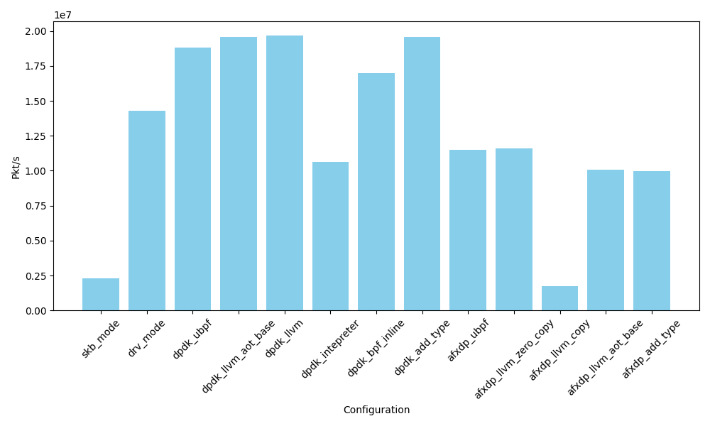
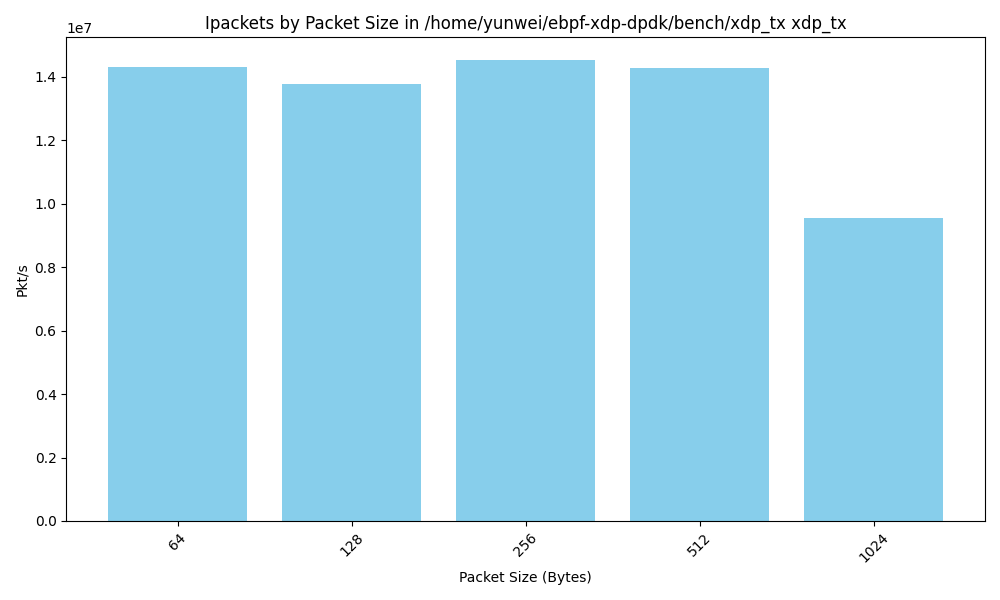

# test framework and results

<!-- TOC -->

- [test framework and results](#test-framework-and-results)
    - [test setup](#test-setup)
    - [Test configurations](#test-configurations)
        - [DPDK](#dpdk)
        - [af_xdp](#af_xdp)
        - [LLVM JIT](#llvm-jit)
        - [ubpf JIT](#ubpf-jit)
        - [LLVM AOT](#llvm-aot)
    - [Case: xdp_tx](#case-xdp_tx)
    - [Case: xdp_map_access](#case-xdp_map_access)
    - [Case: xdp_csum](#case-xdp_csum)
    - [Case: xdp_firewall](#case-xdp_firewall)
    - [Case: xdp_ping](#case-xdp_ping)
    - [Case: xdp_adjust_tail](#case-xdp_adjust_tail)
    - [commands to run the test](#commands-to-run-the-test)

<!-- /TOC -->

## test setup

We have machine octopus1 and octopus3

```txt
+--------+       +--------+
|octopus1|------>|octopus3|
| Pktgen |<------|   NFs  |
+--------+       +--------+
```

- The traffic is generated by pktgen on octopus1 and received by NFs on octopus3. The NFs are running on octopus3, forwards the packets back to octopus1. The traffic generator and measurement tools are `Pktgen-dpdk`.
- The reuslts are measured by the received packets on octopus1. The traffic are generated `60` seconds, and the results are averaged over `60` seconds.
- The controler script is also running on octopus2, use ssh to control the pktgen and get the data from octopus1.

## Test configurations

By default, all userspace eBPF runtime or applications are compiled with `-O3` optimization level, and `LTO` is enabled. We found that ubpf may be error-prone when compiled with `LTO` enabled, so some of the data points may be missing.

For the kernel eBPF, it's tested on `Linux octopus3 6.7.10-zabbly+ #ubuntu22.04 SMP PREEMPT_DYNAMIC x86_64 GNU/Linux`.

### DPDK

The dpdk application is tested with command:

```console
$ sudo -E LD_LIBRARY_PATH=/home/yunwei/ebpf-xdp-dpdk/external/dpdk/install-dir/lib/x86_64-linux-gnu/:/usr/lib64/:/home/yunwei/ebpf-xdp-dpdk/build-bpftime/bpftime/libbpf/:/home/yunwei/ebpf-xdp-dpdk/afxdp/lib/xdp-tools/lib/libxdp/:/home/yunwei/ebpf-xdp-dpdk/build-bpftime-llvm/bpftime/libbpf /home/yunwei/ebpf-xdp-dpdk/dpdk_l2fwd/dpdk_l2fwd_llvm -l 1  --socket-mem=512 -a 0000:18:00.1 -- -p 0x1

load eBPF program xdp_pass
set entry program xdp_pass
init eBPF runtime success
EAL: Detected CPU lcores: 48
EAL: Detected NUMA nodes: 1
EAL: Detected static linkage of DPDK
EAL: Multi-process socket /var/run/dpdk/rte/mp_socket
EAL: Selected IOVA mode 'PA'
```

It's using a single core and single port, with 512MB memory. The application is modified from the `l2fwd` example in the dpdk.

### af_xdp

The af_xdp example is tested with

```sh
cd ebpf-xdp-dpdk/afxdp/l2fwd
sudo ./xdpsock --l2fwd -i enp24s0f1np1
```

The kernel eBPF part is:

```c

struct {
	__uint(type, BPF_MAP_TYPE_XSKMAP);
	__uint(max_entries, MAX_SOCKS);
	__uint(key_size, sizeof(int));
	__uint(value_size, sizeof(int));
} xsks_map SEC(".maps");

int num_socks = 0;
static unsigned int rr;

SEC("xdp_sock") int xdp_sock_prog(struct xdp_md *ctx)
{
	rr = (rr + 1) & (num_socks - 1);
	return bpf_redirect_map(&xsks_map, rr, XDP_DROP);
}
```

The default configuration is:

```txt
  Options:
  -q, --queue=n Use queue n (default 0)
  -f, --frame-size=n   Set the frame size (must be a power of two in aligned mode, default is 4096).
  -d, --duration=n      Duration in secs to run command.
                        Default: forever.
  -b, --batch-size=n    Batch size for sending or receiving
                        packets. Default: 64
  -W, --policy=POLICY  Schedule policy. Default: SCHED_OTHER
  -U, --schpri=n       Schedule priority. Default: 0
  -B, --busy-poll      Busy poll.
  -R, --reduce-cap      Use reduced capabilities (cannot be used with -M)
  -F, --frags           Enable frags (multi-buffer) support
```

It will run on single core, the kernel will default using zero copy mode and xdp-native mode.

### LLVM JIT

The baseline configuration for LLVM based JIT.

- Generated LLVM IR from eBPF bytecode. We don't add type information to the IR at this level, so some constraints amybe missing, such as the type of the function, loop bounds, pointer layout, etc.
- Optimized with `-O3` level in the JIT compiled.
- load with the same linker as the AOT runtime.

See https://github.com/eunomia-bpf/bpftime/tree/master/vm/llvm-jit

### ubpf JIT

The baseline configuration for ubpf JIT.

This is a port of ubpf JIT in bpftime.

- Generated Native insts from eBPF bytecode.
- No additional optimization is applied.
- The compile process is faster.

See https://github.com/eunomia-bpf/bpftime/tree/master/vm/simple-jit

### LLVM AOT

bpftime AOT engine can compile the LLVM IR from the eBPF bytecode to a `.o` file, or directly load and check a precompiled native object file as the AOT results. It can help us explore better optimization approaches.

The linker(Which help load AOT programs into the runtime) checks:

- The type of the functions and helpers are correct.
- The stack and maps layout are correct.
- All necessary helpers are available in the runtime.

A typical workflow for the AOT process would be:

- The eBPF application create all maps, eBPF prorgams and define which helper set to use. This information is stored in shared memory.
- The relocation of map id or BTF will be performed by the eBPF application with the help of the runtime.
- The verifier checks the eBPF programs, maps, and helpers.
- The AOT compiler `#1` compiles the verified eBPF programs to LLVM IR and Native code, or `#2` based on the type information from the source code, we do some additional process in AST level from the source code with our tools, and compile them to LLVM IR and Native code.
- The AOTed object file is loaded by the runtime with the build-in linker, and can be executed by the runtime as other eBPF programs.

The AOT process will do:

- Compile with `-O3 -fno-stack-protector` and make sure the stack layout is correct.
- Replace the entrance of the eBPF program with function name `bpf_main`.
- All the helpers are replace with corresponding type info and name like `_bpf_helper_ext_0028`

There are three possible optimizaions in AOT:

- Add Type information and allow the LLVM to do better optimization.
    - Observe: The eBPF bytecode is typeless, so if we JIT from the bytecode only, the LLVM will not be able to do some optimization, such as inlining, loop unrolling, SIMD, etc. With the type information, the LLVM can do better optimization.
    - Approach: Add type information to the LLVM IR or from the source code.
- inline helpers.
    - Observe: Some helpers, such as copy data, strcmp, calc csum, generated random value, are very simple and Don't interact with other maps. They exist because the limitation of verifier. Inline them will avoid the cost of function call and enabled better optimizaion from LLVM.
    - Approach: Prepare a helper implementations in C or LLVM IR, which can be compile and linked with the AOT eBPF res.
    - We could also use better and specific implementation for the helpers.
- inline maps.
    - Observe: some maps are for configurations only, once they are loaded, they will not be read by userspace programs. They are also not shared between different eBPF programs. For example, the `target_pid` filtter in the tracing programs, or some config maps in network programs. Inline them will avoid the cost of map lookup and enabled better optimizaion from LLVM, since the eBPF inst will need helpers or something like `__lddw_helper_map_by_fd` to access them.
    - Approach: inline the maps as global variables in the native code, so that it can be process by the AOT linker. The linker will allocate this `global variables` as the real global variables in the runtime instead of maps, and replace the map access with the address of the global variable directly.

## Case: xdp_tx

A very simple xdp program, swap the source and destination mac address and return `XDP_TX`. This is the based struct of all the other xdp programs we are measuring.

```c
static void swap_src_dst_mac(void *data)
{
	unsigned short *p = data;
	unsigned short dst[3];

	dst[0] = p[0];
	dst[1] = p[1];
	dst[2] = p[2];
	p[0] = p[3];
	p[1] = p[4];
	p[2] = p[5];
	p[3] = dst[0];
	p[4] = dst[1];
	p[5] = dst[2];
}

SEC("xdp")
int xdp_pass(struct xdp_md *ctx)
{
	void *data_end = (void *)(long)ctx->data_end;
	void *data = (void *)(long)ctx->data;
	struct ethhdr *eth = data;
	int rc = XDP_PASS;
	long *value;
	u16 h_proto;
	u64 nh_off;
	long dummy_value = 1;

	nh_off = sizeof(*eth);
	if (data + nh_off > data_end)
		return rc;

	swap_src_dst_mac(data);
	rc = XDP_TX;

	h_proto = eth->h_proto;
	return XDP_TX;
}

char _license[] SEC("license") = "GPL";
```

The results for different configurations are:



The results for different pkt sizes, on drv mode:



The results for different pkt sizes, on skb mode:


The results for different pkt sizes, on afxdp_llvm_jit_copy mode:


The results for different pkt sizes, on afxdp_llvm_jit_zero_copy mode:


The results for different pkt sizes, on dpdk_llvm_jit mode:


## Case: xdp_map_access

## Case: xdp_csum

## Case: xdp_firewall

## Case: xdp_ping

## Case: xdp_adjust_tail

## commands to run the test

Test all for a single use case

```sh
sudo ./test_all.sh xdp_map_access
```

generate the plot graph

```bash
NAME=xdp_map_access python3 /home/yunwei/ebpf-xdp-dpdk/bench/plot_mode.py
```

make to run a single test case

```sh
sudo BASIC_XDP_NAME=xdp_csum make xdp_csum/dpdk_llvm_aot
```
