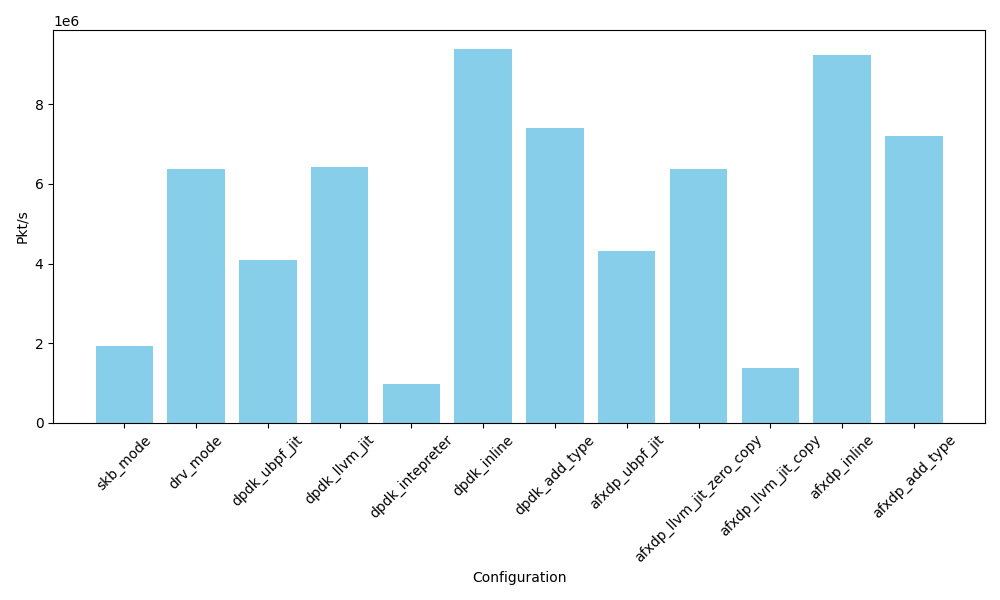
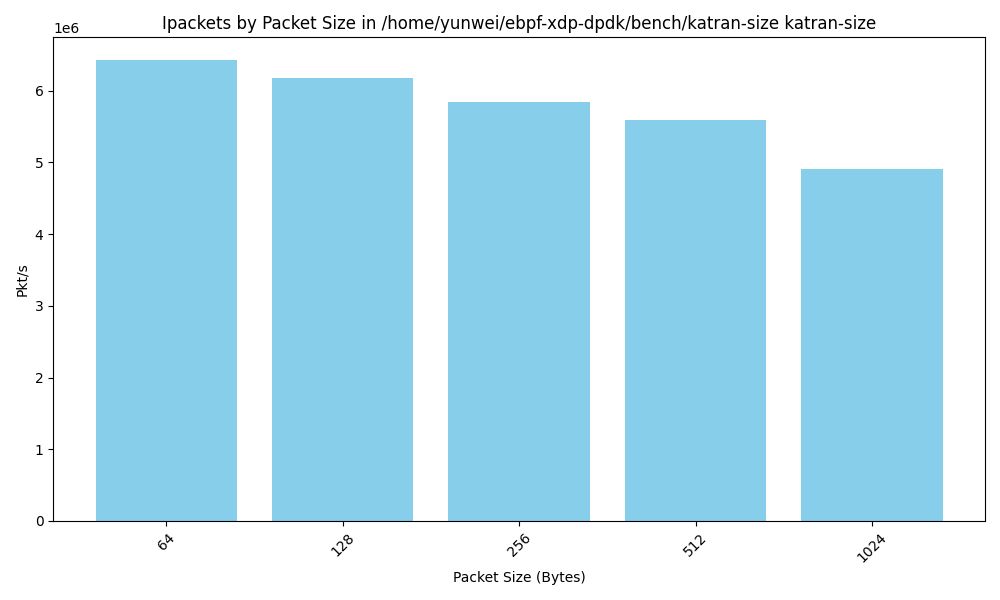

# Bench and optimize katran on userspace eBPF

Katran performance test and optimization record.

- [Bench and optimize katran on userspace eBPF](#bench-and-optimize-katran-on-userspace-ebpf)
  - [Setup configuration](#setup-configuration)
    - [Workflow of katran and testbed](#workflow-of-katran-and-testbed)
    - [config katran: same section](#config-katran-same-section)
    - [test command in kernel](#test-command-in-kernel)
    - [test command in userspace](#test-command-in-userspace)
  - [Test results](#test-results)
    - [Compare different configurations](#compare-different-configurations)
    - [Compare different source port range(cache hit rate)](#compare-different-source-port-rangecache-hit-rate)
    - [Compare of different pkt size](#compare-of-different-pkt-size)
  - [Discussion](#discussion)
  - [Appendix](#appendix)
    - [Default katran cache config](#default-katran-cache-config)
    - [Debug](#debug)

## Setup configuration

The setup configuration of katran.

### Workflow of katran and testbed

1. katran receives packet
2. Checks if the destination of the packet is configured as a
VIP (virtual IP address - IP address of the service).
3. For an incoming packet toward a VIP - katran is checking if it saw packet from the same
session before, and if it has - it sends the packet to the same real (actual server/l7 lb
which then processes/terminates the TCP session).
4. If it's a new session - from 5 tuples in the packet, calculate a hash value.
5. Using this hash value - pick a real server.
6. Update session table with this lookup information so that katran can simply
lookup this information for the next packet in the session and not calculate the hash again.
7. Encapsulate packet in another IP packet and send to the real.

Topology:

```sh
# client is octopus1, with pktgen-dpdk
# katran is octopus3
<client> ---- <net> ---- <server:katran> ---- <net> ---- <client>
```

Packet flow looks like this:

1. From "client" to "katran" (which advertises VIP reachability to the network) it's IP packets with a src of "client" and dst of the VIP.
2. When "katran" receives this packets, it encapsulates them and sends to the real. this packets are going to be IPIP encapsulated. inner header would state the same ("client" -> "VIP"). The outer header contains specifically crafted src address and destination would be address of the "server".
3. When server receives this IPIP packet - it removes outer ip header, and processes original packet and while sending replies - it sends it directly from the "VIP" to the "client".

### config katran: same section

- Default Mac address(Octopus1): b8:3f:d2:2a:e5:11
- Ipv4 Dest: 192.168.1.13:5678

Config system:

```sh
sudo systemctl stop irqbalance
sudo systemctl disable irqbalance
sudo ethtool --offload enp24s0f1np1  lro off
sudo ethtool --offload enp24s0f1np1  gro off
```

Set the ip:

```sh
./example_grpc/goclient/bin/main -A -t 192.168.1.13:5678
./example_grpc/goclient/bin/main -a -t 192.168.1.13:5678 -r 192.168.1.11
```

The LRU cache size is set to 2000, and the src port of generated packets is:

- 0-0: (only single session)
- 0-1000
- 0-2000
- 0-6000
- 0-8000
- 0-16000

This can help answer: how the LRU cache hit affect the performance. (We can also draw a figture of hit rate.)

### test command in kernel

Run katran:

```sh
sudo /home/yunwei/katran/_build/build/example_grpc/katran_server_grpc -balancer_prog /home/yunwei/ebpf-xdp-dpdk/documents/katran/balancer.bpf.o -default_mac b8:3f:d2:2a:e5:11 -forwarding_cores=0 -intf=enp24s0f1np1 -hc_forwarding=false
```

An alternative to load in xdp program only:

```sh
sudo xdp_progs/xdp_tx /home/yunwei/ebpf-xdp-dpdk/documents/katran/balancer.bpf.o enp24s0f1np1
```

### test command in userspace

load in userspace:

> It has some bug with libunwind in octopus3 (but not in my machine), it will sigsegv in mmap, maybe related to LD_PRELOAD.

```sh
sudo BPFTIME_ALLOW_EXTERNAL_MAPS=true LD_PRELOAD=/home/yunwei/ebpf-xdp-dpdk/build-bpftime-llvm/bpftime/runtime/syscall-server/libbpftime-syscall-server.so ./_build/build/example_grpc/katran_server_grpc -balancer_prog /home/yunwei/ebpf-xdp-dpdk/documents/katran/balancer_user.bpf.o -default_mac de:ad:be:ef:00:02 -forwarding_cores=0 -intf=enp24s0f1np1 -hc_forwarding=false
```

An alternative to load in xdp program only:

```sh
sudo LD_PRELOAD=/home/yunwei/ebpf-xdp-dpdk/build-bpftime-llvm/bpftime/runtime/syscall-server/libbpftime-syscall-server.so SPDLOG_LEVEL=debug BPFTIME_ALLOW_EXTERNAL_MAPS=true  xdp_progs/xdp_tx /home/yunwei/ebpf-xdp-dpdk/documents/katran/balancer_user.bpf.o enp24s0f1np1 xdp-ebpf-new/base.btf
```

Start dpdk and af_xdp is the same as others, for example

```sh
sudo -E LD_LIBRARY_PATH=/path/to/repo/external/dpdk/install-dir/lib/x86_64-linux-gnu/:/usr/lib64/:/home/yunwei/ebpf-xdp-dpdk/build-bpftime/bpftime/libbpf/:afxdp/lib/xdp-tools/lib/libxdp/:/home/yunwei/ebpf-xdp-dpdk/build-bpftime-llvm/bpftime/libbpf dpdk/dpdk_llvm -l 1  --socket-mem=512 -a 0000:18:00.1 -- -p 0x1
```

See bench [README.md](README.md) for more details.

## Test results

The test results:

### Compare different configurations



TODO: optimize maps in runtime

### Compare different source port range(cache hit rate)

Kernel driver mode:


Userspace dpdk llvm jit:


### Compare of different pkt size

Kernel driver mode:


Userspace dpdk llvm jit:



## Discussion

- Need more optimize on the runtime before optimize code (2-3 days)
  - already fix some performance issues related to hash map and percpu map
  - need more benchmark and perf test

The default hash map profile:

```console
# ........  ........  ...............  .......................  ....................................................................>
#
    41.54%     0.00%  dpdk_llvm  [unknown]                [k] 0x0020105090230100
            |
            ---0x20105090230100
               |          
               |--30.35%--0x7f761b343b14
               |          |          
               |          |--29.05%--bpftime::hash_map_impl::elem_lookup(void const*)
               |          |          |          
               |          |          |--17.36%--boost::interprocess::offset_ptr<boost::unordered::detail::node<boost::interprocess::>
               |          |          |          |          
               |          |          |           --10.36%--bool boost::intrusive::algo_equal<boost::container::vec_iterator<boost::i>
               |          |          |          
               |          |          |--8.80%--unsigned long boost::unordered::detail::mix64_policy<unsigned long>::apply_hash<bpfti>
               |          |          |          
               |          |           --1.06%--void boost::container::vector<unsigned char, boost::interprocess::allocator<unsigned >
               |          |          
               |           --0.72%--bpftime::bpf_map_handler::map_lookup_elem(void const*, bool) const
               |          
               |--1.75%--0x7f761b343b81
               |          |          
               |           --1.05%--bpftime::per_cpu_array_map_impl::elem_lookup(void const*)
               |          
               |--1.56%--bpftime_map_lookup_elem_helper
               |          
               |--1.17%--0x7f761b343c2e
               |          |          
               |           --1.08%--bpftime::bpf_map_handler::map_lookup_elem(void const*, bool) const
               |          
               |--0.74%--0x7f761b343aed
```

## Appendix

### Default katran cache config

We have test traffic generator configurations in kernel(Default lru size is 8,000,000):

- src port range: 0-0:   lru hit: 100.00% lru miss: 0.00% (only single session)
- src port range: 0-100: lru hit: 100.00% lru miss: 0.00%
- src port range: 0-1000 lru hit: 85.43% lru miss: 14.57%
- src port range: 0-2000 lru hit: 64.80% lru miss: 35.20%
- src port range: 0-6000 lru hit: 52.85% lru miss: 47.15%
- src port range: 0-8000 lru hit: 28.56% lru miss: 71.44%

The map content:

```console
$ sudo bpftool map dump id 470
[{
        "key": {
            "": {
                "vip": 218212544,
                "vipv6": [218212544,0,0,0
                ]
            },
            "port": 11798,
            "proto": 6
        },
        "value": {
            "flags": 0,
            "vip_num": 0
        }
    }
]
$ sudo bpftool map
517: lru_hash  name katran_lru  flags 0x0
        key 40B  value 16B  max_entries 8000000  memlock 966220096B
        pids katran_server_g(261219)
518: array  name ctl_array  flags 0x0
        key 4B  value 8B  max_entries 16  memlock 448B
        btf_id 770
        pids katran_server_g(261219)
519: hash  name vip_map  flags 0x0
        key 20B  value 8B  max_entries 512  memlock 55744B
        btf_id 770
        pids katran_server_g(261219)
520: lru_hash  name fallback_cache  flags 0x0
        key 40B  value 16B  max_entries 1000  memlock 122752B
        btf_id 770
        pids katran_server_g(261219)
521: array_of_maps  name lru_mapping  flags 0x0
        key 4B  value 4B  max_entries 128  memlock 1344B
        pids katran_server_g(261219)
$ sudo bpftool map dump id 521
key: 00 00 00 00  inner_map_id: 517 
Found 1 element
$ sudo bpftool map dump id 518
[{
        "key": 0,
        "value": {
            "": {
                "value": 19675963604920,
                "ifindex": 718421944,
                "mac": [184,63,210,42,229,17
                ]
            }
        }
    },{
```

check result:

```console
./example_grpc/goclient/bin/main -l
2024/05/19 13:49:34 vips len 1
VIP:         192.168.1.13 Port:   5678 Protocol: tcp
Vip's flags: 
 ->192.168.1.11      weight: 1 flags: 
exiting
yunwei@octopus3:~/katran$ ./example_grpc/goclient/bin/main  -s -lru
summary: 373360644 pkts/sec. lru hit: 100.00% lru miss: 0.00% (tcp syn: 0.00% tcp non-syn: 0.00% udp: 1.00%) fallback lru hit: 373364861 pkts/sec
```

### Debug

compile the xdp only:

```sh
cd ~/katran
clang -I./usr/include -I./include -I./ -DDEBUG -D__KERNEL__ -Wno-unused-value -Wno-pointer-sign -Wno-compare-distinct-pointer-types -O2 -target bpf -g katran/lib/bpf/balancer.bpf.c -c -o balancer.bpf.o
```

load with gdb:

```sh
sudo gdb  xdp_progs/xdp_tx
```

Once inside `gdb`, execute the following commands:

```sh
set environment BPFTIME_ALLOW_EXTERNAL_MAPS true
set environment LD_PRELOAD /home/yunwei/ebpf-xdp-dpdk/build-bpftime-llvm/bpftime/runtime/syscall-server/libbpftime-syscall-server.so
set args /home/yunwei/ebpf-xdp-dpdk/documents/katran/balancer_user.bpf.o enp24s0f1np1 
run
```

disable xdp for enp24s0f1np1:

```sh
sudo ip link set dev enp24s0f1np1 xdp off
sudo ip link set dev enp24s0f1np1 xdpgeneric off
```
