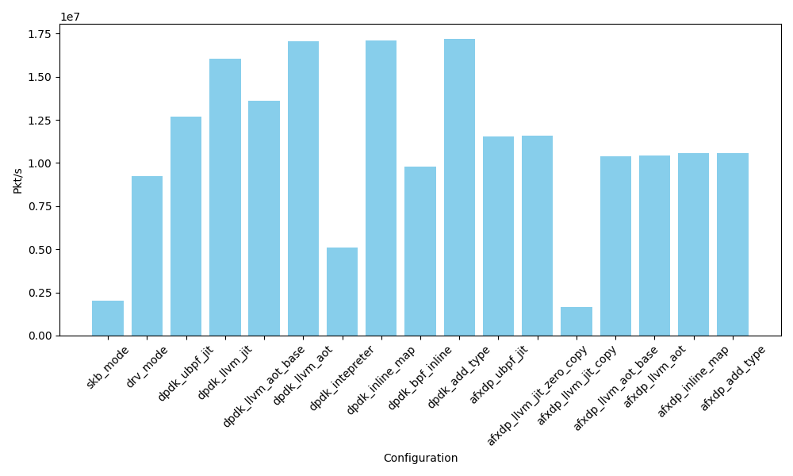
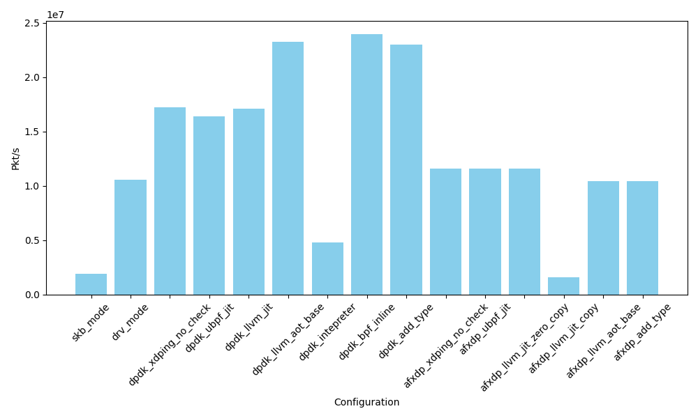

# Running NFs in userspace

## Motivation

We have observed two main reasons to do that:

1. Write once and run everywhere NFs
2. We find that Modern eBPF XDP NFs is complex and taking long time to exec in kernel space, because of the safety requirements, the generic nature of the eBPF runtime. In a single core, the difference of average time of fetching and redirect a packet between kernel Driver with XDP, and DPDK with userspace eBPF is about 10-30ns, but it might take 100-500ns for complex NFs like firewall, load balancer to exec.
   
## Contibution

- A new system allow various kinds of eBPF XDP based NFs to run in userspace with DPDK or AF_XDP, provide full compatibility with kernel and performance better than in kernel space.
- Explore different ways to optimize userspace eBPF runtimes for NFs.

## use cases

- `XDP_PASS`: Pre-stack filtering / processing, Flow sampling, monitoring.
- `XDP_TX`: traffic redirects, load balancers, firewalls and monitoring. We have
  - xdping: use xdp as ping(ICMP) server
  - xdp_map/xdp_map_access: use map to summary the length or count incoming packets
  - xdp_observer/dump traffic: observe the incoming packets and using ring buffer to print the packet and it's content to userspace.
  - xdp load-balancer: a simple load balancer
  - xdp_firewall: a simple black list firewall
  - xdp_adjust_tail: modify pkt too long for ICMP pkt

## Optimize approaches and results

With these approaches, even AF_XDP in userspace can perform better than kernel XDP.

Questions to answer for baseline, see [README.md](README.md):

- How does the performance baseline of kernel driver mode XDP, kernel SKB mode XDP, DPDK and AF_XDP compare, when doing two somple tasks: XDP_PASS and XDP_TX?
- What's the difference for AF_XDP copy mode and zero copy mode?
  
And for optimization, see below:

### SIMD - can work

Case: xdp_hash_sum

Calc the sum for the fist 60 bytes of the packet, and calc the xxhash value for the sum. This is a comman patern for people want to implement load-balance and need hash, and the hash code is from paper `Fast In-kernel Traffic Sketching in eBPF`.


- How complex will make the kernel eBPF program to be slowr than userspace eBPF program? 
- What's the difference between ubpf jit and llvm jit?
- What's the difference if we use SIMD instructions in userspace?

Results: A hash function that would take about 40ns to exec in kernel eBPF or ubpf will be reduce to 5-10ns in userspace eBPF with SIMD instructions. This can overwin the performance gap between kernel and userspace. Even if not enabled SIMD, afxdp is 30% better than driver mode. AF XDP itself costs 75ns, driver mode itself costs 60ns, but here we can see the bottleneck comes from eBPF runtime.

- eBPF source C code -> eBPF relocation C code -> Native code
- eBPF source code -> eBPF bytecode code -> LLVM IR -> Native code

```sh
# generate llvm IR
/home/yunwei/ebpf-xdp-dpdk/build-bpftime-llvm/bpftime/tools/aot/bpftime-aot build  /home/yunwei/ebpf-xdp-dpdk/xdp_progs/.output/xdp_map_access.bpf.o --emit_llvm 2> xdp_map_access.ll
# (optional) optimize llvm ir
opt -O3 -S xdp_map_access.ll -opaque-pointers  -o xdp_map_access_opt.ll
# compile llvm IR to native code
clang -O3 -c -o xdp_map_access.o xdp_map_access.ll
# load the native code with aot runtime
sudo -E AOT_OBJECT_NAME=/home/yunwei/ebpf-xdp-dpdk/xdp-firewall/.output/xdp_firewall.aot.o /home/yunwei/ebpf-xdp-dpdk/dpdk_l2fwd/dpdk_l2fwd_llvm -l 1  --socket-mem=512 -a 0000:18:00.1 -- -p 0x1
```

### Inline maps - can work

- Case: xdp_map Using BPF_MAP_TYPE_HASH to summarize the incoming packets length.




- Case: xdp_map_access Using `BPF_MAP_TYPE_ARRAY` and `BPF_MAP_TYPE_PER_CPU_ARRAY` to control income packet XDP_PASS or XDP_TX, summarize the incoming packets count. Is the same code from katran `xdp_pktcntr.bpf.c`.


Help answer:

- What's the difference compare kernel per-cpu hash map(Without lock) and kernel hash map(With lock)? We can see from `kernel Driver mode per-cpu hash map` vs k`ernel Driver mode hash map`.
- What's the difference compare kernel hash maps with userspace inline hash maps(Without lock)? We can see from `kernel Driver mode per-cpu hash map` vs `af_xdp inline map`.
- What if we adpot a more simple hash algorithm? (Assume the key is int type) `DPDK inline map` vs `dpdk inline map simple array`.

For example, llvm ir for `bpf_map_lookup_elem` to a array:

```llvm
@ctl_map = global [2 x i32] zeroinitializer, align 4

define i64 @_bpf_helper_ext_0001(i64 %i, i64 %pos, i64 %2, i64 %3, i64 %4) local_unnamed_addr alwaysinline {
entry:
  %1 = inttoptr i64 %pos to ptr
  %2 = load i32, ptr %1, align 4
  %3 = getelementptr [2 x i32], ptr @ctl_map, i64 0, i64 %2
  %4 = ptrtoint ptr %3 to i64
  ret i64 %4
}
```

## Inline helpers - can work

Case: xdp-tcpclassify

A simple xdp program to observer the incoming xdp packets, try to classify the http 1.1 traffic in tcp payload, and using ring buffer to print the packet and it's oontent to userspace.

Help answer:

- What is the performance improvement if we use inline helpers in AOT compile? See `dpdk inline helpers` vs `dpdk llvm jit`.


We inline the two kernel helpers:

- `bpf_xdp_load_bytes`
- `bpf_strncmp`
  
Results: Show with DPDK, inline helpers in XDP NFs can have a 40% performance improvement.
  
> Note that even if we can use pointer to access the packet data, we still need to first copy the contet to other buffer (like stack or maps) to use the other helper functions. This is because the xdp_md data pointer is 32 bit and other helpers like bpf_strncmp accept 64 bit pointer.

## Avoid checks - may not need

Case: xdping

(Kernel example) use xdp as ping(ICMP) server.

Why we can Avoid checks?

- Can work in cases the xdp program is short and the traffic pattern is already known.
- Since there is not running in kernel, the safety verification is not need so much.



- How does the performance improvement if we avoid the checks? See `dpdk xdping no checks` vs `dpdk llvm jit`.

Results: Not significant, because the checks are not the main cost of the program due to the branch prediction.
