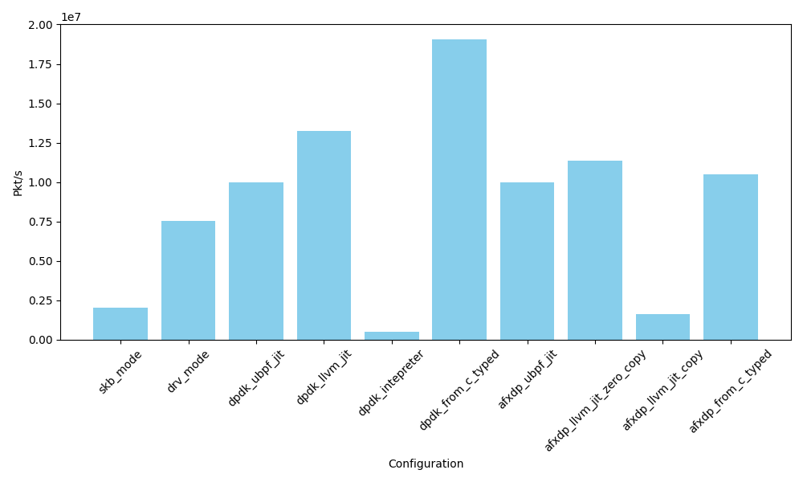
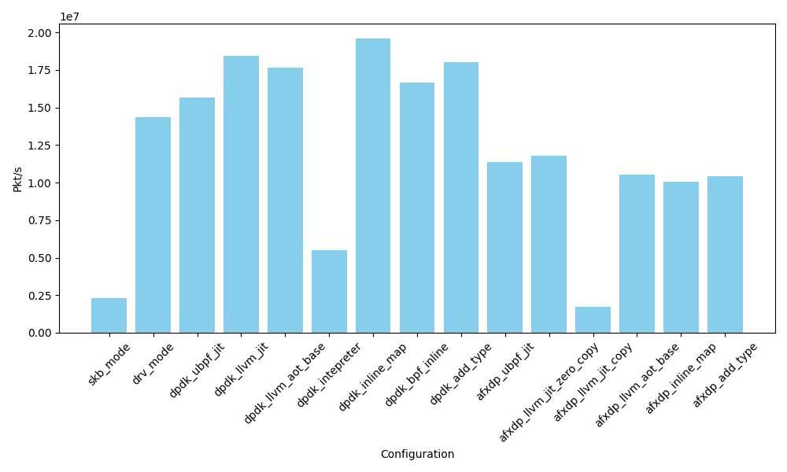

# Running NFs in userspace

## Motivation

We have observed two main reasons to do that:

1. Write once and run everywhere NFs
2. We find that Modern eBPF XDP NFs is complex and taking long time to exec in kernel space, because of the safety requirements, the generic nature of the eBPF runtime. In a single core, the difference of average time of fetching and redirect a packet between kernel Driver with XDP, and DPDK with userspace eBPF is about 10-30ns, but it might take 100-500ns for complex NFs like firewall, load balancer to exec.
   
## Contibution

- A new system allow various kinds of eBPF XDP based NFs to run in userspace with DPDK or AF_XDP, provide full compatibility with kernel and performance better than in kernel space.
- Explore different ways to optimize userspace eBPF runtimes for NFs.

## use cases

- Pre-stack filtering / processing, Flow sampling, monitoring. 
- traffic redirects, load balancers and firewalls

## Optimize approaches and results

With these approaches, even AF_XDP in userspace can perform better than kernel XDP.

Questions to answer for baseline, see [README.md](README.md):

- How does the performance baseline of kernel driver mode XDP, kernel SKB mode XDP, DPDK and AF_XDP compare, when doing two somple tasks: XDP_PASS and XDP_TX?
- What's the difference for AF_XDP copy mode and zero copy mode?
  
And for optimization, see below:

### SIMD - can work

Case: xdp_hash_sum

Calc the sum for the fist 60 bytes of the packet, and calc the xxhash value for the sum. This is a comman patern for people want to implement load-balance and need hash, and the hash code is from paper `Fast In-kernel Traffic Sketching in eBPF`.

- How complex will make the kernel eBPF program to be slowr than userspace eBPF program? 
- What's the difference between ubpf jit and llvm jit?
- What's the difference if we use SIMD instructions in userspace?

Results: A hash function that would take about 40ns to exec in kernel eBPF or ubpf will be reduce to 5-10ns in userspace eBPF with SIMD instructions. This can overwin the performance gap between kernel and userspace.

### Inline maps - can work

Case: xdp_map

Using BPF_MAP_TYPE_HASH to summarize the incoming packets length.

- kernel hash map is slow, we can have better performance with inline userspace hash map.
- The results is better from:
  - avoid the cost of map lookup and enabled better optimizaion from LLVM. Changing from map lookup helpers to directly access global variables.
  - using better or simpler hash algorithm
  - using lock-free hash map instead of kernel lock hash map

> Our userspace eBPF hash map implementation in shared memory is slow. (Can optimize, engineering work, but it's off topic.)

and using array map:

Help answer:

- What's the difference compare kernel per-cpu hash map(Without lock) and kernel hash map(With lock)? We can see from `kernel Driver mode per-cpu hash map` vs k`ernel Driver mode hash map`.
- What's the difference compare kernel hash maps with userspace inline hash maps(Without lock)? We can see from `kernel Driver mode per-cpu hash map` vs `af_xdp inline map`.
- What if we adpot a more simple hash algorithm? (Assume the key is int type) `DPDK inline map` vs `dpdk inline map simple array`.

Also, inline a hash map has better improvement thn inline a global variable array map. Global variable array map is not access by helpers.

## Inline helpers - can work

Case: xdp-tcpclassify

A simple xdp program to observer the incoming xdp packets, try to classify the http 1.1 traffic in tcp payload, and using ring buffer to print the packet and it's oontent to userspace.

Help answer:

- What is the performance improvement if we use inline helpers in AOT compile? See `dpdk inline helpers` vs `dpdk llvm jit`.

We inline the two kernel helpers:

- `bpf_xdp_load_bytes`
- `bpf_strncmp`
  
Results: Show with DPDK, inline helpers in XDP NFs can have a 40% performance improvement.
  
> Note that even if we can use pointer to access the packet data, we still need to first copy the contet to other buffer (like stack or maps) to use the other helper functions. This is because the xdp_md data pointer is 32 bit and other helpers like bpf_strncmp accept 64 bit pointer.

## Avoid checks - may not need

Case: xdping

(Kernel example) use xdp as ping(ICMP) server.

Why we can Avoid checks?

- Can work in cases the xdp program is short and the traffic pattern is already known.
- Since there is not running in kernel, the safety verification is not need so much.

- How does the performance improvement if we avoid the checks? See `dpdk xdping no checks` vs `dpdk llvm jit`.

Results: Not significant, because the checks are not the main cost of the program due to the branch prediction.
