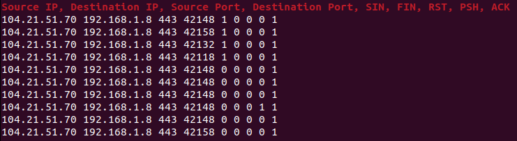

# xdp-observer

A simple xdp application to observe tcp connections in userspace.

Use ring buffer to send data to userspace.

See [documents/bpftime-lb.md](../documents/bpftime-lb.md) for setup.

## How to run in kernel

```console
make -C xdp-observer
# xdp-observer/main veth6
Source IP, Destination IP, Source Port, Destination Port, SIN, FIN, RST, PSH, ACK 
10.0.0.1 10.0.0.10 44698 8000 1 0 0 0 0
10.0.0.1 10.0.0.10 44698 8000 1 0 0 0 0
10.0.0.1 10.0.0.10 44698 8000 1 0 0 0 0
10.0.0.1 10.0.0.10 44698 8000 1 0 0 0 0
```

## run in userspace with bpftime

run server

```console
# LD_PRELOAD=/home/yunwei37/dpdk-startingpoint/build-bpftime/bpftime/runtime/syscall-server/libbpftime-syscall-server.so SPDLOG_LEVEL=debug xdp-observer/main veth6 xdp-ebpf-new/base.btf
Successfully started! Please Ctrl+C to stop.
Source IP, Destination IP, Source Port, Destination Port, SIN, FIN, RST, PSH, ACK 
10.0.0.1 10.0.0.10 44698 8000 1 0 0 0 0
10.0.0.1 10.0.0.10 44698 8000 1 0 0 0 0
10.0.0.1 10.0.0.10 44698 8000 1 0 0 0 0
10.0.0.1 10.0.0.10 44698 8000 1 0 0 0 0
^CTerminating
```

run the AF_XDP program

```console
./af_xdp_user veth6
```

### Screenshot


